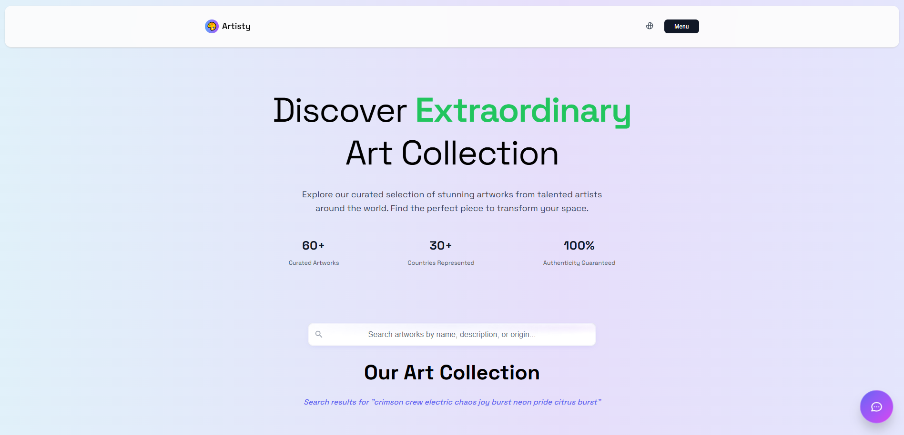
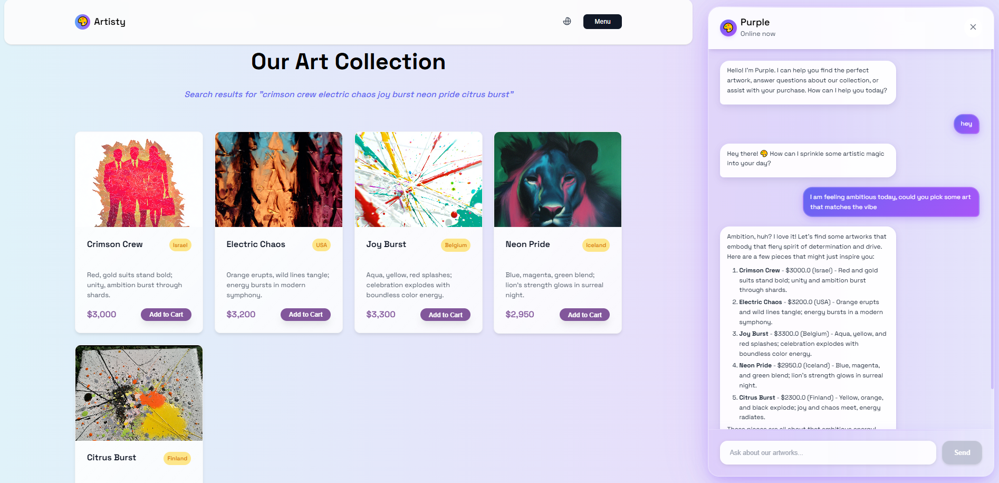

# Artisty

**Reimagining E-shopping experience with AI Agents powered by LangChain, deployed on AWS**

Artisty is a full-stack AI-Agent platform hosted on AWS that reimagines how people explore and purchase art. Instead of clunky filters or endless scrolling, Artisty deploys intelligent agents that act like a personal curator. These agents understand natural conversation, interpret intent, and take real actions in real time — from searching inventory and navigating the gallery to opening quick-views, managing your cart, and guiding checkout.

Try it yourself at [www.artisty.shop](https://artisty.shop/)

### Main Page

### Agent in Action

[CLICK HERE FOR DEMO VIDEO](https://youtu.be/0wxVcU0LoxM)

[LEAVE YOUR FEEDBACK HERE](https://citrine-hamburger-7f5.notion.site/26f19d49e5c18076a3e4f4318f512ff5?pvs=105)

### Technical Features

| Tech | Description |
|---------|-------------|
| OpenAI API | For LLM support |
| Langchain | For tool usage and agent orchestation |
| AWS Route 52 | Domain, routing and metrics |
| AWS Amplify - React + JS - Frontend | Modern, type-safe UI, deployed on AWS Amplify |
| AWS Lambda - Python - Backend | Python-based serverless, scalable architecture |
| Amazon S3 | Used to package Lambda layers |
| AWS API Gateway | Manages secure connections between frontend and backend |
| CloudWatch | For logging and monitoring |
| Docker | Used to package Lambda layers |
| CORS Support | Secure API access |
| Github Action | For CI/CD |

## Architecture Overview

1. **Planner Agent (LangChain Tools Agent)**: Decides when to answer directly vs. call a tool
2. **Tools**: `search_inventory`, `quick_view`, `add_to_cart`, `navigate`, `checkout`
3. **Conversation Memory**: Short-term memory scoped to warm Lambda container lifetime
4. **Inventory Grounding**: Validates artwork names against inventory to avoid hallucinations
5. **Frontend Event Bus**: Receives `web_actions` and performs UI operations (search, scroll, popup, cart, navigation)

### Agent Architecture

All decision-making is handled by AI agents rather than manual rules, ensuring intelligent and flexible responses to user queries.

## What It Can Do

- **Natural Language Search**: Ask for art using everyday language like "show me vibrant pieces from Asia under $2000"
- **Intelligent Recommendations**: AI analyzes your preferences and suggests 1-10+ relevant artworks
- **Real-time Streaming Responses**: Word-by-word streaming with immediate actions
- **Agentic Actions**: AI automatically navigates gallery, opens popups, adds to cart, and manages checkout
- **Smart Cart Management**: "Show me my cart" → AI opens cart page and provides status
- **Regional Understanding**: Knows geographic mappings (Asia = Japan, China, Korea, Thailand, India, Vietnam, etc.)
- **Conversational Memory**: Remembers context within conversations for better assistance
- **Real-time Gallery Navigation**: Automatically scrolls and displays suggested artworks
- **Interactive UI Control**: AI controls quick-view popups, cart operations, and page navigation
- **Inventory-Aware Responses**: Only suggests available pieces from the actual collection

## What It Cannot Do

- Generate or create new artworks
- Provide art authentication or provenance verification
- Access external art databases or inventories
- Remember preferences across different browser sessions
- Suggest artworks not in the current inventory

## How Search Works in Frontend

The frontend implements intelligent search through multiple mechanisms:

### **1. Chatbot-Triggered Search**
- AI agent analyzes user requests and extracts artwork names
- Names are sent as space-separated pairs to the frontend
- Frontend treats these as explicit selections and displays only those artworks in the suggested order
- Example: Agent suggests "neon pride jungle rhythm" → Frontend shows those exact 2 artworks

### **2. Manual Search Bar**
- Users can type directly in the search bar
- Combines semantic search (AI-powered understanding) with keyword fallback
- Semantic search finds top 5 relevant pieces based on meaning and context
- Keyword search provides additional matches for comprehensive results
- Auto-scrolls to gallery section when search is performed

## Example Interactions

**Regional Search with Actions:**
- "What do you have from the UK?" → AI searches UK art + auto-scrolls to gallery
- "Show me pieces from Asia" → Streams response + displays Japan, China, Korea, Thailand, India, Vietnam artworks

**Interactive Shopping:**
- "Add Neon Pride to my cart" → AI adds artwork + shows cart animation + confirms
- "Show me my cart" → AI navigates to cart page + provides status
- "I want to see Golden Gaze closer" → AI opens quick-view popup

**Streaming Conversations:**
- "I want something blue and calming" → Streams word-by-word response + suggests blue artworks
- "What's available under $1500?" → Real-time filtering + immediate gallery update
- "Take me to checkout" → AI navigates to cart + initiates checkout process

## Contributing

1. Fork the repository
2. Create a feature branch
3. Make your changes
4. Add tests if applicable
5. Submit a pull request

## License

MIT License

